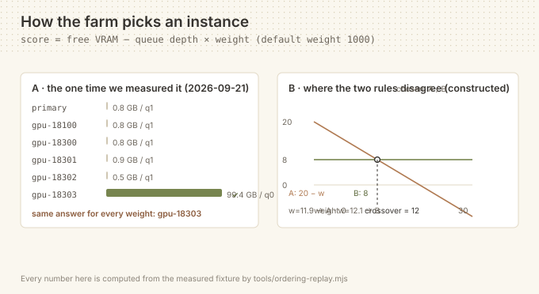

# dsh-zcode-farm

**English** | [中文](README.zh.md)

[](https://github.com/BOWLUNA/dsh-zcode-farm/actions/workflows/test.yml)
[](LICENSE)
[](package.json)
[](package.json)

> Let the DeepSeek Harness agent see a **whole farm** of ComfyUI instances and dispatch each job to the idlest one.

```bash
dsh plugin --profile web add dsh-zcode-farm
```



| | `dsh-comfyui` (77★) | **this plugin** |
| --- | --- | --- |
| Endpoints it can address | one | **many, probed concurrently** |
| Queue depth | read from `/queue`, but with one instance it informs the user rather than a choice | **weighted into the ranking, across instances** |
| When the job lands | on that one instance | on the instance with the **most free VRAM and an empty queue** |
| Writes to ComfyUI | yes | **yes (`comfyui_farm_run`), but reading is enough** |

Zero runtime dependencies · Node ≥ 22 · MIT

---

## Why this exists

ComfyUI's own docs are explicit: **one ComfyUI process executes one workflow at a time**.
Real concurrency only comes from running one process per GPU and routing each job to the
least-busy instance. The ecosystem already has pooling libraries such as `comfyui-orchestrator`.

But when you wire that up to an AI agent, one piece is missing: **the agent can't see the farm.**

Measured on a real machine (a single moment on 2026-09-21, taken with this plugin's own probe):

| Instance | GPU | Free VRAM | Queue | Verdict |
| --- | --- | --- | --- | --- |
| `18100` ← the only one `dsh-comfyui` can see | RTX 5090 | 0.8 / 33.7 GB | 1 running | too full |
| `18300` | RTX 5090 | 0.8 / 33.7 GB | 1 running | too full |
| `18301` | RTX 5090 | 0.9 / 33.7 GB | 1 running | too full |
| `18302` | RTX 5090 | 0.5 / 33.7 GB | 1 running | too full |
| **`18303`** | **RTX PRO 6000 Blackwell** | **99.4 / 102.0 GB** | **0** | **✅ idle** |

`dsh-comfyui` (77★, the most mature plugin in this space) talks to **one** endpoint, so every
generation request hits the busiest machine — while 102 GB of VRAM sits idle.

**This plugin fills exactly that gap: let the agent see, then let it dispatch.**

---

## What it does

Three tools:

| Tool | Purpose |
| --- | --- |
| `comfyui_farm_status` | Full farm view: per-instance GPU, free VRAM, queue depth, what's running, and **who should get the next job** |
| `comfyui_farm_pick` | Choose without executing: filter by VRAM floor / queue ceiling / GPU-name hint / exclude list, and get the **reason** |
| `comfyui_farm_run` | Load-aware dispatch: auto-pick (or force an instance), accepting a raw API workflow or a one-shot "prompt + checkpoint" text-to-image |

---

## Install

```bash
dsh plugin --profile web add dsh-zcode-farm
```

Restart the app and the agent gets all three tools.

---

## Configuration

```yaml
- id: comfyui-farm
  config:
    primaryUrl: 'http://127.0.0.1:8188'
    instances:
      - { id: gpu-18301, baseUrl: 'http://127.0.0.1:18301', label: '5090 shard' }
      - { id: gpu-18303, baseUrl: 'http://127.0.0.1:18303', label: 'Blackwell 102G' }
    needVramGb: 8
    maxQueueDepth: 3
    queueWeight: 1000
    probeTimeoutMs: 5000
    probeRetries: 1
```

### How an instance is chosen (two stages)

1. **Filter** — unreachable, or free VRAM `< needVramGb`, or queue depth `> maxQueueDepth` → out.
2. **Rank** — `score = freeVramGb − queueDepth × queueWeight`

The default `queueWeight = 1000` is deliberate: **queue depth dominates the ranking** and free
VRAM only breaks ties. That matches the intuition — an idle small GPU finishes sooner than a
busy large one.

> Prefer "biggest VRAM wins"? Set `queueWeight: 0`.

---

## Relationship to `dsh-comfyui`: complementary, not competing

| | `dsh-comfyui` (77★) | `dsh-zcode-farm` | How to check the `dsh-comfyui` side |
| --- | --- | --- | --- |
| Scope | **one** endpoint | **a whole** farm | `grep -n baseUrl package/lib/config.js` → one `z.string()` |
| Strength | workflow library, skill packs, canvas, asset panel | awareness, selection, dispatch | `ls package/lib` |
| How a job is routed | wherever the single endpoint is | ranked by `free VRAM − depth × weight` | `grep -n "constructor(baseUrl" package/lib/comfyui.js` |
| Assembly row id | `comfyui` | `comfyui-farm` | both appear in this repo's `cordis.patch.yml` |

The row ids differ, so **both can be installed side by side**. Neither depends on the other.
`dsh-comfyui`'s single-endpoint design is verified from its published source, not asserted —
see "Reproducing the comparison" below for the three commands.

---

## Relationship to ZCode

**This repository is self-developed — there is no ZCode code lineage.** ZCode
(`zai-org/ZCode`, `zai-org/GLM-skills`) is credited here as a *source of inspiration for the
engineering conventions this project follows*, not as a dependency: nothing in the install
path, the runtime, or the acceptance checks requires it, and no third-party vendor key is
involved anywhere in this repository.

Most cells below are therefore deliberately blank rather than filled with something invented.

| What ZCode has | What this plugin took | What this plugin adds beyond it | Evidence (run it yourself) |
| --- | --- | --- | --- |
| Nothing for ComfyUI farm scheduling | —— | the whole probe → rank → dispatch loop | `grep -rli comfyui <zcode-checkout> \| wc -l` → **0** |
| A memory-extraction sub-agent with two skip conditions (`apps/zcode-cli/packages/core/src/memory/extraction.ts:23`) | —— (different domain) | —— | *n/a — nothing was taken, so there is no claim to reproduce* |
| Bilingual paired documents | adopted as the house convention | **extended to cover figure files** (`*.svg`), so a diagram can't drift from its translation | `node tools/verify-translation-pairing.mjs` |
| Guard discipline — runnable checks before every commit | adopted as the house convention | **extended to six guards, the sixth being a real-boot check** | `node test/run.mjs` and `node tools/boot-check.mjs --port 32041` |

A row reading `——` is an honest blank, not an oversight.

---

## Reproducing the comparison

Nothing above needs to be taken on trust. These are the commands behind it:

```bash
git clone https://github.com/BOWLUNA/dsh-zcode-farm && cd dsh-zcode-farm
node test/run.mjs                        # 23 checks in 2 suites
node tools/ordering-replay.mjs           # the ranking table behind the figure
node tools/boot-check.mjs --port 32041   # really installs and really boots (needs a harness)
```

The `dsh-comfyui` claims are checked against its published package, not against this repo:

```bash
npm view dsh-comfyui version                # 0.5.1
npm pack dsh-comfyui@0.5.1 && tar xzf dsh-comfyui-0.5.1.tgz
grep -n baseUrl package/lib/config.js       # a single string, not a list
grep -n "constructor(baseUrl" package/lib/comfyui.js
```

```text
9:    baseUrl: z.string().default('http://127.0.0.1:8188'),
71:    constructor(baseUrl, apiKey, connectTimeoutMs, maxMediaBytes) {
```

Run on 2026-09-22 against `dsh-comfyui@0.5.1`.

---

## Design notes

- **Zero runtime dependencies.** Node's built-in `fetch` / `AbortController` only.
- **No workflow editing.** That's `dsh-comfyui`'s territory; this plugin only answers "who gets it".
- **No assumption of locality.** Every member is just a URL — SSH tunnels, LAN and remote hosts
  are treated identically. The 5 tunnels on the test machine are plain `ssh -L` forwards.
- **Probe failures are retried.** Tunnel flakiness is real: the same instance once timed out at
  `>3s` and answered in `106ms` on the very next call. A single failure is not a verdict — we
  retry, then report `attempts` so the agent can tell "down" from "hiccup".
- **Failure reasons are never overwritten.** When filtering by GPU hint, an unreachable instance
  keeps its "unreachable" reason instead of being relabelled "GPU mismatch", which would hide
  the actual problem.

---

## Development

```bash
npm test                              # unit tests (pure functions, no network)
node probes/probe-farm.mjs            # standalone probe: farm status only
node probes/probe-tools.mjs           # load the entry and really execute the tools (read-only)
node probes/probe-tools.mjs --run     # actually dispatch one job (smallest payload: 512² / 12 steps)
```

During development the host-provided peer deps (`@deepseek-ai/schemastery` and its deps) must be
present in a local `node_modules/`, otherwise the entry cannot be imported. This is not needed
when installed into a real profile — the host supplies them.

---

## Known limitations

- The built-in template of `comfyui_farm_run` covers **minimal text-to-image** only
  (KSampler + CheckpointLoaderSimple + EmptyLatentImage + 2× CLIPTextEncode + VAEDecode + SaveImage).
  For anything richer, pass a `workflow`.
- **Aliases pointing at the same backend are not detected.** If you configure both a switchable
  forwarder (e.g. `127.0.0.1:8188` → "currently focused instance") and its real target, you will
  see two members with identical readings. That is honest reporting, not a bug — probing cannot
  distinguish them.
- `number` returned by `/prompt` is a server-side **cumulative counter**, **not a queue position**
  (measured: it returns 22 even when the queue is empty). Trust `comfyui_farm_status` for real queue depth.

---

## License

MIT

---

## Status

- **2 suites**, **23 checks** — run `node test/run.mjs`
- Declared compatibility: `>=0.1.5-rc.2 <0.2.0-0` (see `engines.dsh` and the peer range)
- Pin the version to bypass pnpm's release cooldown: `dsh plugin --profile web add dsh-zcode-farm@1.0.1`
- Verified against five SSH-tunnelled ComfyUI instances plus one switchable forwarder
